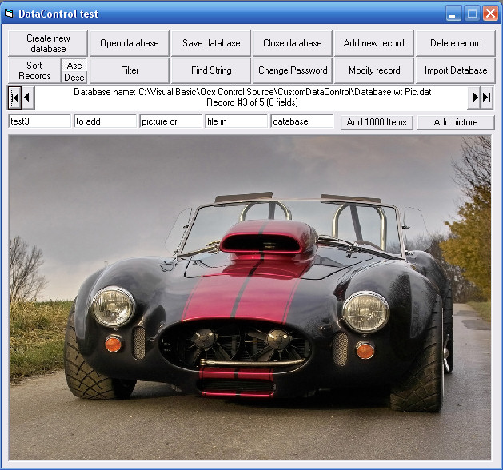



## Custom Data Control

### Description

Update: You can now insert any kind of file in database, change the password of a database and many others improvements

This as fast custom database control with a lot of features like: new database creation, sort, field find, multi-fields filter, password protection, etc...

(Not really commented but easy to understand!)

(Thank you to "Rde" for is "Stable Quick Sort")
 
### More Info
 

             |
---                |---
**Submitted On**   |2007-02-01 00:24:38
**By**             |[Christian Coutu](https://github.com/Planet-Source-Code/PSCIndex/blob/master/ByAuthor/christian-coutu.md)
**Level**          |Intermediate
**User Rating**    |4.7 (14 globes from 3 users)
**Compatibility**  |VB 6\.0
**Category**       |[Data Structures](https://github.com/Planet-Source-Code/PSCIndex/blob/master/ByCategory/data-structures__1-33.md)
**World**          |[Visual Basic](https://github.com/Planet-Source-Code/PSCIndex/blob/master/ByWorld/visual-basic.md)
**Archive File**   |[Custom\_Dat204563212007\.zip](https://github.com/Planet-Source-Code/christian-coutu-custom-data-control__1-67751/archive/master.zip)

